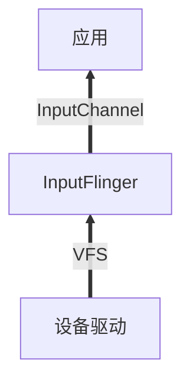

# Android Input的分层

​	Android的input子系统大概是在2019年的3、4月份开始接触的，主要是因为负责Input部分的同事离职了，我就当仁不让地接上了这个话。Android是一个交互式的操作系统，显示与输入都是一个重要的组成部分。Android支持多种多样的输入设备，如触摸、游戏手柄、按键、鼠标、键盘等等。

​	基于Android与Linux的关系，Android的input子系统也是可分成三层：设备驱动层 - inputflinger层 - 应用处理层。设备驱动层与inputflinger层之间是通过Linux的设备驱动节点进行连接，inputflinger与应用层之前是通过InputChannel来进行连接。

​	设备驱动层决定了系统支持什么类型的设备，没有对应的驱动配置就成了巧妇难为无米之炊，如果没有触摸驱动，那么如何来触摸，USB没有配置好，那么USB鼠标键盘如何使用。设备驱动层是基础，后面在对这部分分析的时候，我们不针对具体的设备驱动，而是对input事件的从驱动层到用户节点的过程。

​	inputflinger是Android的快递员，接收底层驱动投递的输入事件，然后经过封装分发给对应的客户。这一块也是目前接触最多的部分，后面将重点分析这一块。

​	应用层则是Android真正处理事件的地方，输入事件的存在感就是由处理它的人体验的，这一部分很多时候已经被各种view给处理，剩余的则由应用去处理，平时我们所override的onKeyDown/onTouchEvent等等回调，就是我们研究的对象。

# 分析步骤

 	1. InputFlinger的工作原理
      	1. 设备的配置文件
      	2. KeyEvent的处理过程
      	3. TouchEvent的处理过程
 	2. InputChannel的创建
 	3. InputFlinger分发事件到应用的过程
 	4. Driver的事件上报过程。

# 总结

​	学无止境，每次重新看代码都会有不同的感悟，特别是Android版本的更新频繁，虽大体的框架不会变动太大，但也是有无穷的东西需要学习和总结。
